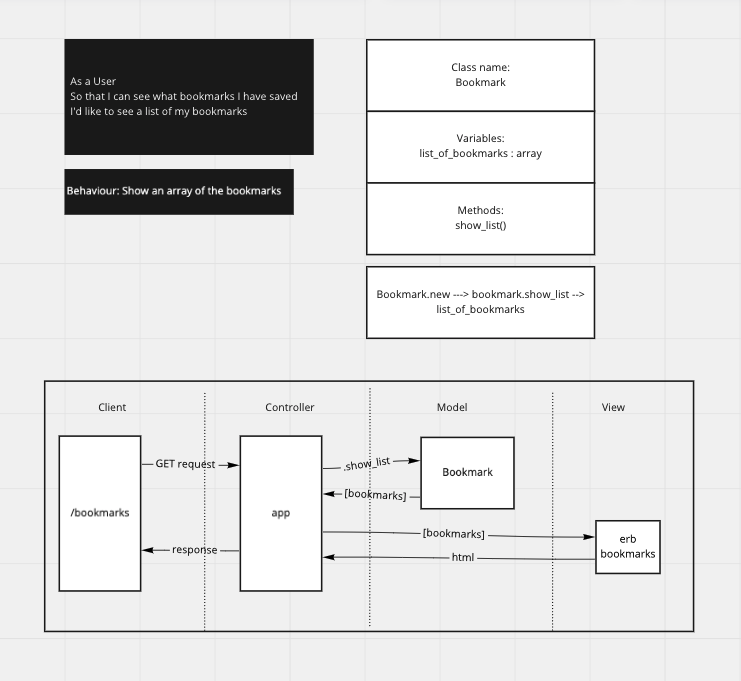

# Bookmarks Manager
A website to maintain a collection of bookmarks (URLs). Where a user can save a webpage they found useful. Tags can be addded to the webpages saved to find them later. Bookmarks can be browsed that other users have added and comments can be made on the bookmarks.

----
<br>

## How to set up a database
1. Connect to ```psql```
2. Create a database using the ```psql``` command ```CREATE DATABASE bookmarkmanager```;
3. Connect to the database using the ```psql``` command ```\c bookmarkmanager;```
4. Run the query we saved in the file: <a href='01_create_bookmarks_table.sql'>Migrations</a>

<br>

## User Stories:
<br>

```
1:
As a User
So that I can efficiently access my favourite websites
I'd like to see a list of all my saved bookmarks
```
<br>

### Domain Model 1:
<br>

